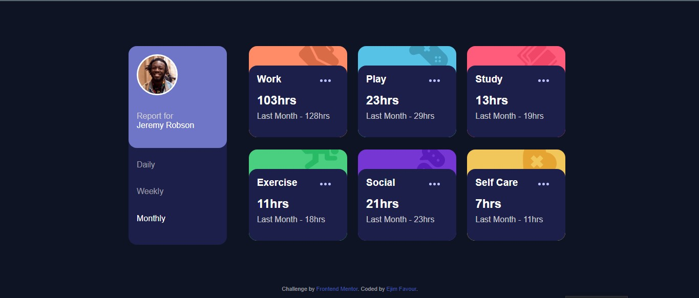

# Frontend Mentor - Time tracking dashboard solution

This is a solution to the [Time tracking dashboard challenge on Frontend Mentor](https://www.frontendmentor.io/challenges/time-tracking-dashboard-UIQ7167Jw). Frontend Mentor challenges help you improve your coding skills by building realistic projects.

## Table of contents

- [Overview](#overview)
  - [The challenge](#the-challenge)
  - [Screenshot](#screenshot)
  - [Links](#links)
- [My process](#my-process)
  - [Built with](#built-with)
  - [What I learned](#what-i-learned)
  - [Continued development](#continued-development)
- [Author](#author)

## Overview

This is a dashboard that shows and tracks the time of a user performing different activities

### The challenge

Users should be able to:

- View the optimal layout for the site depending on their device's screen size
- See hover states for all interactive elements on the page
- Switch between viewing Daily, Weekly, and Monthly stats

### Screenshot



### Links

- Solution URL: [Add solution URL here](https://your-solution-url.com)
- Live Site URL: [Add live site URL here](https://ejim11.github.io/Time-Tracking-Dashboard/)

## My process

### Built with

- Semantic HTML5 markup
- CSS custom properties
- Flexbox
- Javascript

### What I learned

I learnt a lot about DOM manipulation and event handlers. i got accustomed to flexbox and its use cases.


```css
.inner-heading {
  display: flex;
  align-items: center;
  justify-content: space-between;
}
```

```js
monthly.addEventListener("click", function () {
  monthly.querySelector("a").style.color = "#fff";
  weekly.querySelector("a").style.color = "rgb(204, 204, 209, 0.719)";
  daily.querySelector("a").style.color = "rgb(204, 204, 209, 0.719)";
  workCurrent.textContent = "103hrs";
  workPrevious.textContent = "Last Month - 128hrs";
  playCurrent.textContent = "23hrs";
  playPrevious.textContent = "Last Month - 29hrs";
};
```

### Continued development

I would love to know more on DOM manipulation and event handler functions


## Author

- Frontend Mentor - [@ejim11](https://www.frontendmentor.io/profile/yourusername)
- Twitter - [@favourejim56](https://www.twitter.com/yourusername)
